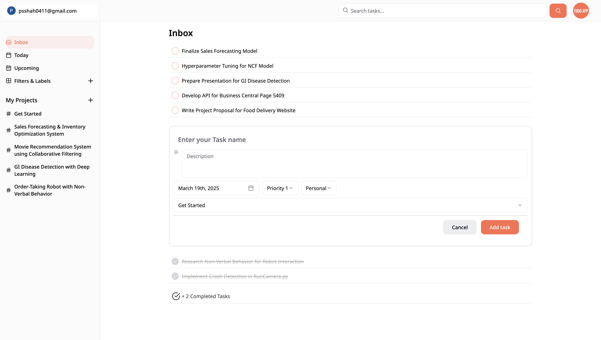
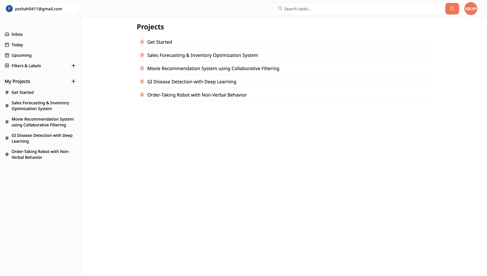
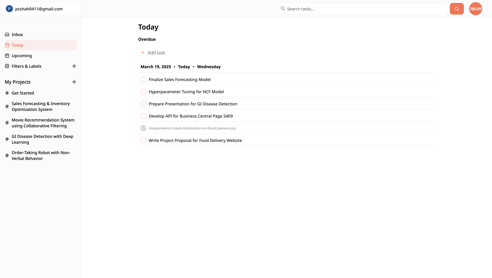
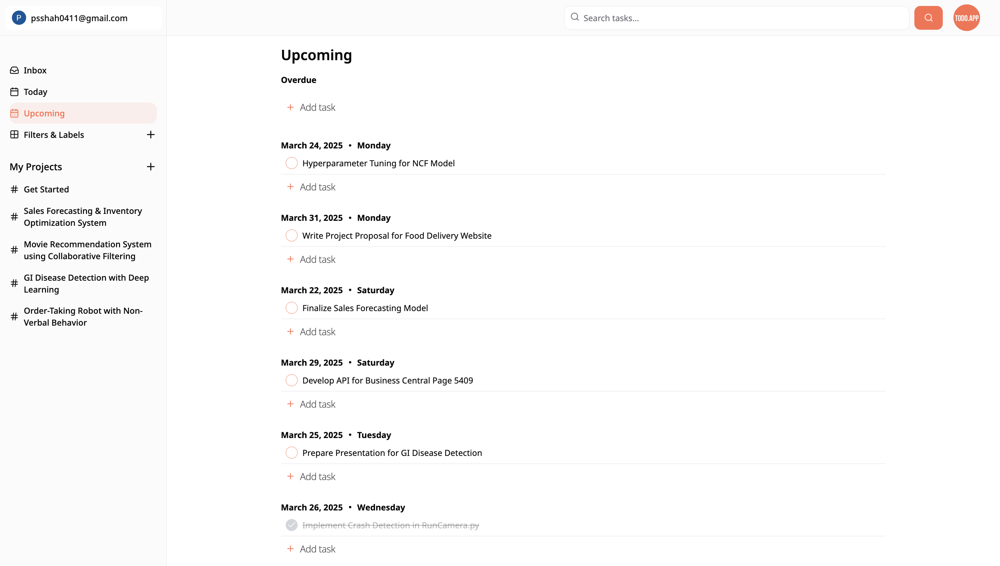
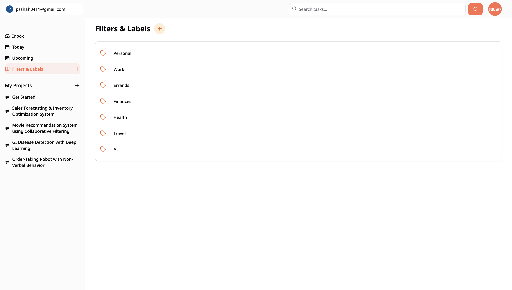

# ai-powered-todo-app 

Built with the Next.js 14 App Router, Convex, React, Next.js Auth V5 (Auth.js), Google Sign-In, ShadCN UI library, React Hook Forms, TypeScript, OpenAI, TailwindCSS, and more.

## Table of Contents
- [Features](#features)
- [Screenshots](#screenshots)
  - [Main Page](#main-page)
  - [Projects Page](#projects-page)
  - [Today & Upcoming Screens](#today--upcoming-screens)
  - [Labels Screen](#labels-screen)
- [Getting Started](#getting-started)
  - [Clone/Fork](#fork-and-clone)
- [License](#license)

## Features
- 🌐 Next.js & Server Actions
- 🤖 AI Suggests Missing Tasks and Sub-Tasks using OpenAI
- 🎨 Beautiful components using Shadcn UI
- 💅 Slick designs using TailwindCSS
- 🌟 Database powered by Convex
- 🎭 Amazing icons thanks to Lucide React
- 🔐 Authentication using Next Auth (Auth.js) with Google Sign-In
- 📋 Runtime validation with TypeScript and Zod
- 🚀 Form validation using React Hook Forms
- ❤️ Add Task Dialog popup
- 💔 Deletion of Tasks Dialog popup
- ✚ Addition of Sub-Tasks
- 💔 Deletion of Sub-Tasks Dialog popup
- 📜 Creation and deletion of Projects and Labels
- 🔄 Sidebar Navigation
- 🏆 Vector Search for your Tasks
- 📱 Full Mobile Responsiveness
- 🛬 Landing Page
- 🚀 Deployment on Vercel
- 🎁 ...much more

## Screenshots

Below are some screenshots showcasing the current implementation:

### Main Page

*The landing page with a modern design and engaging hero section.*

### Projects Page

*Easily manage and view your projects with a clean interface.*

### Today & Upcoming Screens


*View tasks for today and upcoming deadlines at a glance.*

### Labels Screen

*Organize your tasks with customizable labels.*

## Getting Started

To get started with this project, follow these steps:

1. **Clone the Repository**
   - Clone project locally:
     ```bash
     git clone https://github.com/parthshah04/ai-powered-todo-app.git
     cd ai-powered-todo-app
     ```

2. **Set Up Environment Variables**
   - Copy the `.env.example` file to `.env.local`:
     ```bash
     cp .env.example .env.local
     ```
   - Fill in the required credentials. 

3. **Install Dependencies**
   - Install project dependencies using your package manager:
     ```bash
     npm install
     # or
     yarn install
     ```

4. **Run the Convex Server**
   - In a separate terminal window, start the Convex local server:
     ```bash
     npx convex dev
     ```
   - This will run the Convex backend necessary for the project.

5. **Run the Development Server**
   - Start your local development server:
     ```bash
     npm run dev
     # or
     yarn dev
     ```
   - Visit [http://localhost:3000](http://localhost:3000) in your browser.


## License

This project is licensed under the [MIT License](https://choosealicense.com/licenses/mit/).
